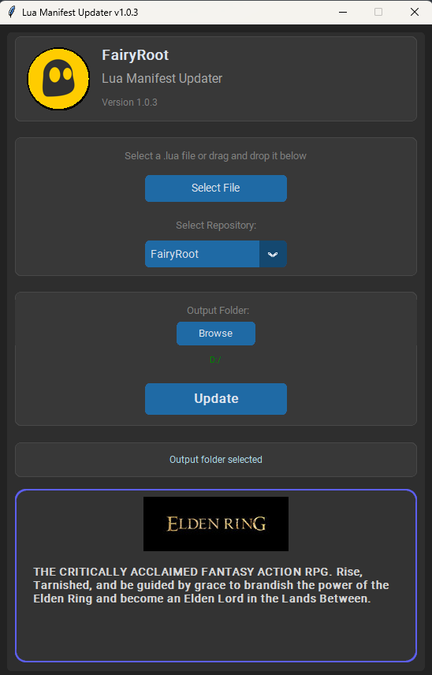

# Lua Manifest Updater (LMU)

<div align="center">
  
</div>

**Lua Manifest Updater (LMU)** is a user-friendly tool designed to update Lua files with the latest manifest IDs for Steam games, streamlining the process of keeping game configurations current.

<div align="center">
  
</div>

**Note**: This tool primarily updates manifest IDs within existing Lua files. For downloading the manifest files themselves initially, you might need a separate tool or source for the game's manifest data.

## Features

*   **File Input:** Easily select `.lua` files through a standard file dialog or by using intuitive drag-and-drop functionality.
*   **Game ID Extraction:** Automatically identifies and extracts the Steam Game ID from the content of the selected `.lua` file.
*   **Steam Game Information Display:** Fetches and displays the game's official capsule image and a brief description from Steam based on the extracted Game ID. Includes a "Click to refresh" option if the initial fetch fails.
*   **Configurable Repository Selection:**
    *   Allows users to select different source repositories for game manifest archives via a dropdown menu.
    *   The repository list is populated from a `repo.json` configuration file, offering flexibility in choosing manifest sources.
    *   The "default" repository path specified in `repo.json` is automatically selected when the application starts.
*   **Manifest Download (Standard Mode):**
    *   Downloads the latest manifest archive (typically a `.zip` file, named `<game_id>.zip`) for the specified game ID from the chosen GitHub repository.
    *   Extracts all `.manifest` files from the downloaded archive.
*   **Lua File Update:** Intelligently updates the manifest IDs within the provided `.lua` file using the information from the newly obtained `.manifest` files.
*   **Output Generation:** Creates a new `.zip` archive (named `<game_id>.zip`) containing the updated `.lua` file (which is also renamed to `<game_id>.lua` inside the archive) and all the relevant `.manifest` files.
*   **Custom Output Directory:** Users can specify a custom output directory for the generated zip file. The application defaults to an `Updated Files` subdirectory on the user's Desktop.
*   **Clickable Author Image:** The author's image in the header now directly links to their Telegram profile for easy contact.
*   **Distinguishable UI Sections:** The user interface now uses different background colors and borders for various sections (header, file input, output, status, DND area) to improve visual clarity and organization.
*   **Comprehensive Status & Error Handling:** Provides clear, color-coded status messages throughout the process (e.g., downloading, extracting, success, error). Manages potential issues like invalid file types, network errors, extraction problems, or missing Game IDs gracefully.

---

## Installation

### Clone the Repository

```bash
git clone https://github.com/fairy-root/lua-manifest-updater.git
cd lua-manifest-updater
```

### Prerequisites

1.  **Python:** Ensure you have Python 3.8 or a newer version installed.
2.  **Dependencies:** Install the required Python packages by running:

    ```bash
    pip install -r requirements.txt
    ```
    This will install `customtkinter`, `requests`, `Pillow`, `beautifulsoup4`, and `tkinterdnd2`.

---

## Configuration

The application uses a `repo.json` file located in its root directory to manage the list of GitHub repositories used for downloading manifest archives.

**`repo.json` Structure Example:**

```json
{
  "default": "Fairyvmos/BlankTMing",
  "FairyRoot Main": "Fairyvmos/BlankTMing",
  "Another Source": "username/another-repo",
  "Community Repos": "community-user/game-manifests"
}
```

*   **`"default"`: (Required)** Specifies the GitHub repository path (e.g., `"username/repository"`) that should be selected by default in the dropdown. The application will attempt to find a key in the list that matches this path to set as default. If no exact key matches, this path itself will be added as an option and selected.
*   **Other Keys (e.g., `"FairyRoot Main"`, `"Another Source"`):** These are user-defined, friendly names that will appear in the repository selection dropdown. The value associated with each key is the actual GitHub repository path (`"username/repository"`).

**Default `repo.json`:**
If `repo.json` is not found when the application starts, a default one will be created automatically:

```json
{
  "default": "Fairyvmos/BlankTMing",
  "FairyRoot": "Fairyvmos/BlankTMing"
}
```

---

## Usage

1.  **Run the Application**:
    Navigate to the `lua-manifest-updater` directory in your terminal and execute:
    ```bash
    python app.py
    ```

2.  **Select Lua File**:
    *   Click the "Select File" button to open a file dialog and choose your `.lua` file.
    *   Alternatively, drag and drop your `.lua` file directly onto the designated "Drag and drop .lua file here" area.
    *   The application will then attempt to extract the Game ID and display the game's information (image and description) in the DND area.

3.  **Select Repository**:
    *   From the "Select Repository" dropdown, choose the GitHub repository from which to download the game's manifest archive. The list is populated from your `repo.json` file.

4.  **Select Output Folder (Optional)**:
    *   Click the "Browse" button next to "Output Folder" to choose a specific directory where the final updated `.zip` file will be saved.
    *   If no folder is selected, it defaults to a subfolder named `Updated Files` on your Desktop.

5.  **Start Update Process**:
    *   Click the "Update" button.

6.  **Monitor Progress**:
    *   Observe the status messages at the bottom of the window. They will indicate the current operation (e.g., "Downloading...", "Extracting files...", "Updating Lua file..."), and report success or any errors encountered.

7.  **Retrieve Output**:
    *   Once completed successfully, the final `.zip` file, containing the updated Lua script and associated manifest files, will be available in the specified output folder.

---

## Notes

*   Ensure you have a stable internet connection for downloading manifest archives and game information.
*   If downloads are consistently failing, especially from GitHub, consider using a **VPN** as network restrictions or regional blocks might be in place.
*   The `.lua` file must contain a recognizable `addappid` function call for the Game ID to be extracted correctly.

---

## Donation

Your support is greatly appreciated and helps in maintaining and improving this tool:

-   **USDt (TRC20)**: `TGCVbSSJbwL5nyXqMuKY839LJ5q5ygn2uS`
-   **BTC**: `13GS1ixn2uQAmFQkte6qA5p1MQtMXre6MT`
-   **ETH (ERC20)**: `0xdbc7a7dafbb333773a5866ccf7a74da15ee654cc`
-   **LTC**: `Ldb6SDxUMEdYQQfRhSA3zi4dCUtfUdsPou`

## Author

-   **GitHub**: [FairyRoot](https://github.com/fairy-root)
-   **Telegram**: [@FairyRoot](https://t.me/FairyRoot) (Clickable from the app header!)

## Contributing

Contributions are welcome! If you'd like to improve Lua Manifest Updater:

1.  Fork the repository.
2.  Create a new branch for your feature or bug fix.
3.  Make your changes, ensuring code clarity and adherence to the existing style.
4.  Test your changes thoroughly.
5.  Submit a pull request with a clear description of your modifications.

## License

This project is licensed under the MIT License - see the [LICENSE](LICENSE) file for details.